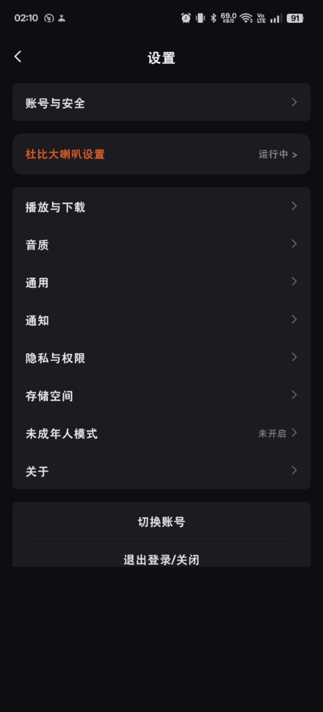
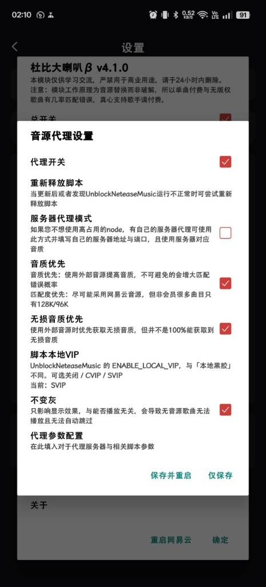
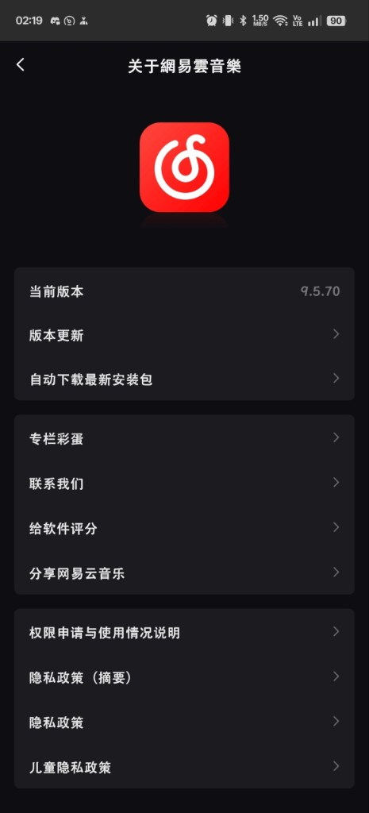

# 杜比大喇叭β版

网易云音乐音源代理模块。工作原理为**音源替换而非破解**，单曲付费与无版权歌曲有几率匹配错误，真心支持歌手请付费。

网易云音乐音源代理模块。工作原理为**音源替换而非破解**，单曲付费与无版权歌曲有几率匹配错误，真心支持歌手请付费。

网易云音乐音源代理模块。工作原理为**音源替换而非破解**，单曲付费与无版权歌曲有几率匹配错误，真心支持歌手请付费。

当前版本 **4.1.0**（fork 自 [luoxingran/dolby_beta](https://github.com/luoxingran/dolby_beta)，原作 [nining377/dolby_beta](https://github.com/nining377/dolby_beta)）。

安装后请在 LSPosed 勾选网易云，并**强制停止**后再打开。设置入口在网易云「设置」页。脚本异常时可在模块里使用「重新释放脚本」。已在网易云 **9.5.70** 验证。

  

## 4.1.0 更新

- 内嵌 [UnblockNeteaseMusic/server](https://github.com/UnblockNeteaseMusic/server) `enhanced` 最新脚本（v0.28.0）

[下载 Release](https://github.com/NikolaJyun/dolby_beta/releases/latest)

## 打赏

如果这个模块对你有帮助，欢迎打赏支持。

 

## 致谢

[UnblockNeteaseMusic/server](https://github.com/UnblockNeteaseMusic/server)

[nondanee/UnblockNeteaseMusic](https://github.com/nondanee/UnblockNeteaseMusic)

[luoxingran/dolby_beta](https://github.com/luoxingran/dolby_beta)

[nining377/dolby_beta](https://github.com/nining377/dolby_beta)
